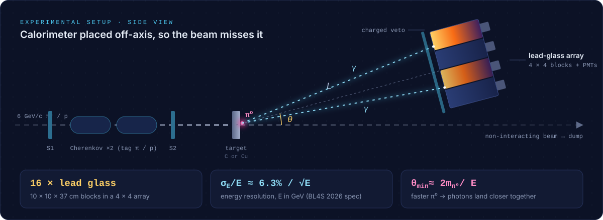
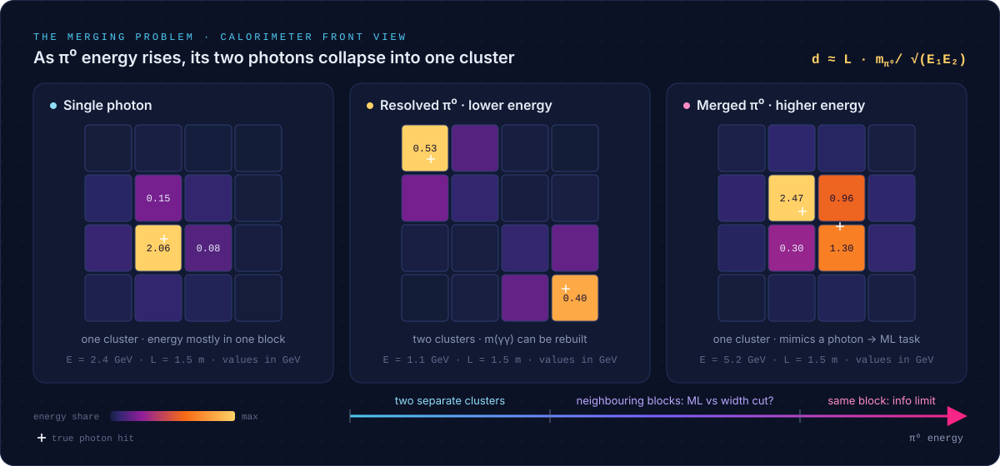
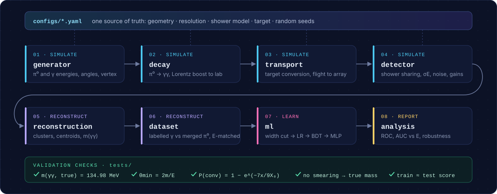

<p align="center">
  
</p>

<p align="center">
  
  
  
  
  <a href="LICENSE"></a>
</p>

<p align="center">
  <b>Can a classifier tell a single photon from a merged π⁰ using only 16 numbers?</b><br>
  A simulation study of the lead-glass calorimeter used in Beamline for Schools experiments.
</p>

<p align="center">
  <a href="#overview">Overview</a> ·
  <a href="#research-questions">Questions</a> ·
  <a href="#the-setup">Setup</a> ·
  <a href="#the-merging-problem">Merging</a> ·
  <a href="#pipeline">Pipeline</a> ·
  <a href="#getting-started">Getting started</a> ·
  <a href="#roadmap">Roadmap</a> ·
  <a href="#team">Team</a>
</p>

---

## Overview

A neutral pion (π⁰) lives for about 85 attoseconds and almost always decays into two photons. Measure both photons in a calorimeter and their invariant mass

$$m_{\gamma\gamma}^2 = 2E_1E_2\,(1-\cos\theta_{12})$$

forms a peak at the π⁰ mass, 135 MeV.

There is a catch. The faster the π⁰, the smaller the angle between its photons ( $\theta_{\min}\approx 2m_{\pi^0}/E$ ). In a calorimeter made of coarse 10 cm blocks, a high-energy π⁰ puts both photons into neighbouring blocks, or the same block, and becomes indistinguishable from a single photon.

This project simulates the 16-block lead-glass calorimeter available to [Beamline for Schools](https://beamlineforschools.cern/) (BL4S) teams and asks two things:

1. **How should the experiment be laid out** to reconstruct π⁰ → γγ cleanly?
2. **How much can machine learning recover** π⁰s whose photons have merged into one cluster, and where does the detector itself make that impossible?

The same photon-versus-π⁰ problem is a major background at the LHC (for example in H → γγ searches). Here it is studied at a scale where every step can be understood and checked.

> The project grew out of our proposal to the 2026 edition of BL4S. It turns the open feasibility questions of that proposal into a reproducible simulation study.

## Research questions

| | Question | Main output |
|---|---|---|
| **Q1 · Geometry** | Where should the array sit (distance *L*, angle *θ*) to reconstruct π⁰ → γγ, and what mass resolution can 10 cm blocks reach? | acceptance vs *L* and *θ*, width of the m(γγ) peak |
| **Q2 · Targets** | How many photon pairs are lost to conversion in copper vs carbon targets of matched interaction length? | conversion-loss table |
| **Q3 · Classification** | How well do a width cut, logistic regression, gradient-boosted trees and a small neural network separate single photons from merged π⁰s? | ROC curves, AUC vs π⁰ energy |
| **Q4 · Information limit** | Above what π⁰ energy *E\** does the block size make separation impossible? | *E\** where AUC → 0.5 |

**Hypotheses** (fixed before any results were produced):

- **H1:** Machine-learning classifiers outperform the width cut mainly where the two photons share neighbouring blocks.
- **H2:** Above some energy *E\**, both photons hit a single block and every method falls to chance (AUC ≈ 0.5).

## The setup

<p align="center">
  
</p>

The array sits **off the beam axis** so the beam (about 10⁴–10⁵ particles per spill) passes beside it instead of showering inside it. The Cherenkov counters tag whether each beam particle was a pion or a proton.

| Parameter | Value | Source |
|---|---|---|
| Beam | 6 GeV/c mixed hadron beam (mostly π⁺ and p) | CERN PS test beam, BL4S 2026 |
| Calorimeter | 16 lead-glass blocks, 10 × 10 × 37 cm, 4 × 4 array | BL4S 2026 *Beams and Detectors* |
| Energy resolution | σ<sub>E</sub>/E ≈ 6.3 % / √E (E in GeV) | BL4S 2026 *Beams and Detectors* |
| Targets | carbon and copper, thin, matched in interaction length | this study |
| Radiation length X₀ | carbon ≈ 19 cm, copper ≈ 1.44 cm | Particle Data Group |

## The merging problem

<p align="center">
  
</p>

The photon separation on the calorimeter face is roughly

$$d \approx L\,\frac{m_{\pi^0}}{\sqrt{E_1E_2}}$$

At *L* = 1.5 m, a 1.1 GeV π⁰ splits its photons by about 37 cm, which gives two clean clusters. A 5.2 GeV π⁰ splits them by only about 8 cm, less than one block, so they merge into a single cluster. That middle region, where photons share neighbouring blocks, is where a classifier might beat a simple shower-width cut.

<sub>Figure values come from a simplified two-component shower model and are illustrative. The study tests how much the conclusions depend on this model.</sub>

## Pipeline

<p align="center">
  
</p>

| # | Module | Responsibility |
|---|---|---|
| 01 | `generator` | π⁰ and single-photon kinematics: energy, direction, production vertex in the target |
| 02 | `decay` | π⁰ → γγ in the rest frame, Lorentz boost to the lab |
| 03 | `transport` | photon conversion in the target, straight-line flight, hit on the array face |
| 04 | `detector` | transverse shower sharing, energy smearing, noise, threshold, block-to-block gain errors |
| 05 | `reconstruction` | clustering, centroid positions, invariant mass |
| 06 | `dataset` | labelled single-γ vs merged-π⁰ samples, energy-matched so models learn shape, not energy |
| 07 | `ml` | width-cut baseline → logistic regression → gradient-boosted trees → MLP |
| 08 | `analysis` | ROC curves, AUC vs energy, robustness to shower model and calibration, paper figures |

All parameters live in `configs/*.yaml`, so every robustness test is a config swap and every figure can be regenerated.

## Repository structure

```text
pi0-resolve/
├── configs/              # default.yaml + alternative shower / calibration models
├── src/pi0resolve/
│   ├── constants.py      # physical constants (GeV)
│   ├── config.py         # loads configs/*.yaml
│   ├── kinematics.py     # four-vectors, Lorentz boosts, invariant mass
│   ├── generator.py
│   ├── decay.py
│   ├── transport.py
│   ├── detector.py
│   ├── reconstruction.py
│   ├── dataset.py
│   └── ml/               # features, models, training, evaluation
├── tests/                # validation checks (pytest)
├── scripts/              # one entry point per stage and per paper figure
├── notebooks/            # exploration only, never the source of results
├── figures/              # generated plots
├── paper/                # manuscript
└── assets/               # README graphics
```

## Getting started

> [!NOTE]
> The code is under active development. Setup, the decay module and its tests work today; the other commands describe the planned interface.

```bash
git clone https://github.com/<your-org>/pi0-resolve.git
cd pi0-resolve
python -m venv .venv
source .venv/bin/activate        # Windows: .venv\Scripts\activate
pip install -e ".[dev]"        # add ",ml" from Phase 3 on
```

```bash
pytest                                                    # run validation checks
python scripts/check_decay.py                             # decay kinematics figure
python scripts/check_generator.py                         # generator figure
python scripts/simulate.py --config configs/default.yaml  # generate events
python scripts/train.py    --config configs/default.yaml  # train and evaluate classifiers
python scripts/figures.py                                 # rebuild every figure
```

## Validation

Every stage must pass its checks before the next one builds on it:

- [x] True photons reconstruct to m(γγ) = 134.98 MeV exactly
- [x] Minimum opening angle matches 2·arcsin(m/E); photon energy asymmetry is flat
- [x] Dalitz decays (π⁰ → e⁺e⁻γ) are tagged at the PDG rate of 1.174 %
- [x] Generator: production depth follows beam attenuation; toy spectra, beam spot and flat-mode cone match their input distributions
- [ ] Conversion fraction matches 1 − exp(−7x / 9X₀)
- [ ] With smearing switched off, the reconstructed mass equals the true mass
- [ ] Single-γ and merged-π⁰ energy spectra overlap after matching
- [ ] Training and test scores agree (no overfitting)

## Roadmap

- [ ] **Phase 0:** freeze the research question, hypotheses and decision log
- [ ] **Phase 1:** core simulation (generator → detector) passing all checks
- [ ] **Phase 2:** feasibility study: acceptance vs *L*/*θ*, mass resolution, target conversion
- [ ] **Phase 3:** classifiers: baseline cut, LR, BDT, MLP; ROC and AUC vs energy
- [ ] **Phase 4:** robustness: alternative shower models, gain errors, noise
- [ ] **Phase 5:** write-up, physicist feedback, submission to a student research journal
- [ ] *Stretch:* Geant4 cross-check of shower shapes and π⁰ production

## Results

Results will be added here as each phase is completed. Every figure in this section will be reproducible with `scripts/figures.py`.

## Limitations

- **Simulation only.** The classifiers are trained and tested on simulated showers and have not been validated on beam data.
- **Assumed production spectra.** π⁰ energies and angles are inputs, so absolute yields are uncertain. Ratios and trends are more reliable than absolute numbers.
- **Simplified showers.** The transverse shower model is approximate; Phase 4 measures how much conclusions depend on it.
- **Backgrounds not modelled.** Hadronic showers, neutrons and pile-up are outside the scope of the fast simulation.

## Team

**Beam Optimizers**: a team of high-school students from Pakistan who submitted an experiment proposal to the 13th edition of CERN's Beamline for Schools competition (2026).

| Role | Member |
|---|---|
| Simulation lead (generator, decay, transport) | *name* |
| Detector & reconstruction lead | *name* |
| Machine-learning lead | *name* |
| Validation lead | *name* |
| Analysis & figures lead | *name* |
| Writing & literature lead | *name* |
| Coach | *name* |

## Acknowledgements

Detector and beam parameters come from the public BL4S 2026 *Beams and Detectors* document. This is an independent student project. It is not affiliated with or endorsed by CERN, DESY or the University of Bonn.

## Citation

```bibtex
@software{pi0resolve_2026,
  author = {{Beam Optimizers}},
  title  = {{π⁰ Resolve}: Monte Carlo and machine-learning study of neutral-pion
            reconstruction in a coarse lead-glass calorimeter},
  year   = {2026},
  url    = {https://github.com/<your-org>/pi0-resolve}
}
```

## License

Released under the [MIT License](LICENSE).
